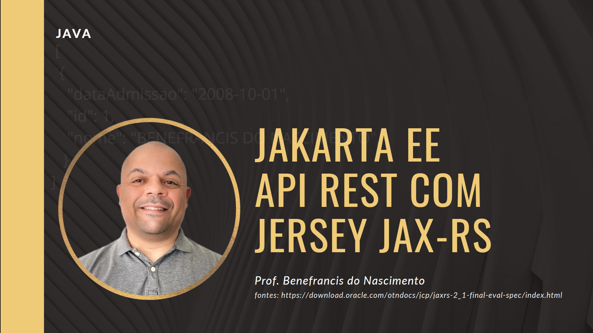

# Desenvolvendo API Restfull com JERSEY JAX RS

Uma das alternativas para o Spring Boot, a JAX-RS API é uma especificação que define interfaces e anotações fornecidas pelo Java EE, que podem ser utilizadas na criação de uma API RESTful.

Entre as bibliotecas existentes, a  implementação da JAX-RS API mais conhecida e utilizada é a Jersey.

Nesta aula, nos vamos transformar em API REST o nosso projeto java que acessa bancos de dados por meio da api JDBC.

Esta API foi construida utilizando JAKARTA EE para auxílio dos alunos do curso de Tecnologia em Análise e Desenvolvimento de Sistemas no Challenge IBM.

# Vídeo Tutorial

# Atenção

Trata-se apenas de um projeto de exemplo para guiar o estudo sobre APIs RESTFULL, não utilize este projeto em produção.

# Como excecutar esta aplicação

1º Certifique-se que tem o Maven instalado e configurado nas variáveis de ambiente do seu sistema operacional;

2º Verifique o arquivo application.properties, pois nele se encontram os parâmetros para conexão com o banco de dados; 

3º Crie as tabelas no banco de dados que escolheu no arquivo application.properties o scripe está na pasta documentos/database;

4 º abra o prompt de comando no mesmo diretório onde se encontra essa aplicação e execute o comando:

    mvn clean package exec:java

5º Você poderá importar no programa postaman os testes utilizados pelo desenvolvedor. O arquivo está na pasta documentos/postman

# Endpoints disponíveis

'coffee' REST Endpoints:

GET	/coffee

POST	/coffee

DELETE	/coffee/{id}

GET	/coffee/{id}

PUT	/coffee/{id}

# Fontes 

Os links abaixo foram fontes de pesquisa para criação deste conteúdo:

    https://eclipse-ee4j.github.io/jersey.github.io/documentation/latest/getting-started.html
    
    
    https://blog.payara.fish/getting-started-with-jakarta-ee-9-hello-world
    
    https://docs.oracle.com/middleware/12212/wls/RESTF/intro-restful-service.htm
    
    https://docs.oracle.com/middleware/12212/wls/RESTF/develop-restful-service.htm#RESTF208
 
    https://blog.payara.fish/getting-started-with-jakarta-ee-9-how-to-create-a-rest-api-with-jakarta-ee-9
 
    https://www.oreilly.com/library/view/restful-java-with/9781449361433/ch04.html
 
    http://www.mastertheboss.com/jboss-frameworks/resteasy/getting-started-with-jakarta-restful-services/
 
 
 
 
